#  LINKEDIN WEB SAYFASI


Bu projemizde lınkedI'nın giriş ve anasayfa bölümlerini HTML5,CSS,BOOTSTRAP,W3.CSS VE JAVASCRİPT kullanarak yapıyoruz.

# Giriş Bölümü - JavaScript

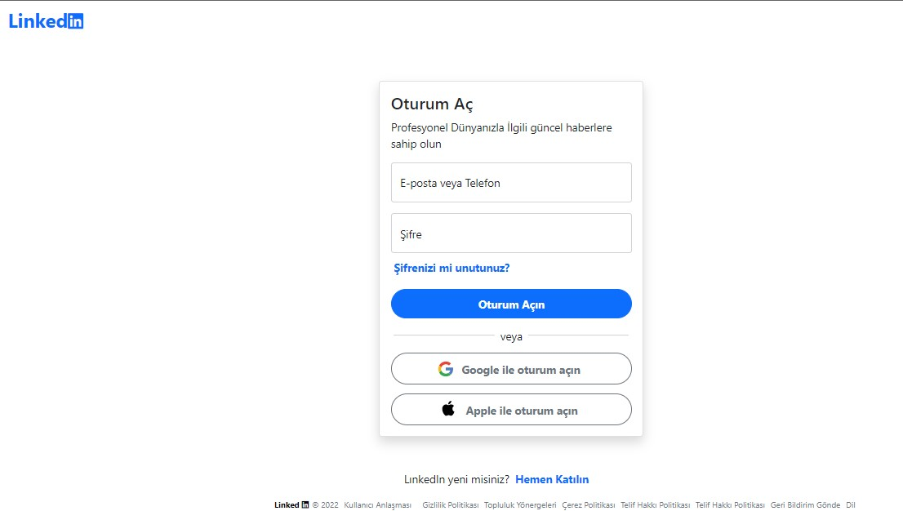


 Bu giriş alanında btn-start classı adı altında 2 tane container yapısı oluşturduk.

Oluşturduğumuz bu containerların ilkinde row kullanarak giriş sayfasındaki LınkedIn sayısını oluşturuyoruz.LınkedIn yazısını col-10'luk bir sütun içinde yazdık.


```javascript
  <div class="btn-start">

    <div class="conatiner">
      <div class="row">
          <div class="col-10 mt-5 ms-5"> <h3><span class="fw-bold text-primary "> Linked<i class="fa-brands fa-linkedin w3-xlarge"></i><span></h3></div>
   
      </div>
     </div>
   
```


Diğer containerımız'nda da giriş alanını oluşturuyoruz.Bu giriş  bölümünü sayfanın ortasına almak için  linked adlı class oluşturuyoruz. Bu  class içinde displa-flex,  align-content:center, ve justify-items:center; classlarını kullanrak cardımızı sayfanın ortasına konumlandırıyoruz

```javascript
.btn-star{
    box-sizing: border-box;
    margin: 0;
    padding: 0;
}

.lınked{
display: flex;
align-content: center;
justify-items: center;   
}
```

Giriş alanımzı oluştururken boostraptan yararlanarak card classını kullanıyoruz. Bu card classı içinde e-mail ve password  olmak üzere 2 tane form elemanı tanımlıyoruz.  Form alanlarımız oluşturduktan ssonrada 3 tane button elemanı ekliyoruz. Bunlardan ilki oturum aç buttonu oluştururken d-grid ve gap-2 classını kullanarak butona belli bir boyut verdik. Btn-primary classını kullanarak da butonumuzun rengini ayarladık . Diğer iki butonumuzda da  birinci butonda kullandığımız classları kulandık ikisinde de sadece buton rengini farklı yaptık. Bu iki butonu renklendirmek için btn btn-outline-secondary sınıfını kullanıyoruz. Bu butonlar Google ile oturum aç ve Apple ile oturum aç butonlarını oluşturmuş olduk.

En son kısımda da iki container alanımızı hazırladıktan sonrada sayfamızın son kısmı olan footer alaınımızı oluşturduk. Footer alanını oluştururken ul tagı içinde li tagları oluşturuyoruz. Ul tagıiçinde list-inline-item list-group ve list-group-horizontal  classlarını  kullanarak oluşturduğumuz listeyi aşağı doğru maddeler şeklinde değilde yan yan olacak şekilde yapıyoruz.

```html
     <div class="me-5 d-flex ft mt-2 mb-2 ">
        <footer>
          <ul class="list-inline-item list-group list-group-horizontal list-unstyled">
            <li> <span class="fw-bold text-black" style="font-size:11px">Linked <i class="fa-brands fa-linkedin w-smalll"> </i></span> 
              <span class="text-muted me-2" style="font-size:11px;">© 2022</span></li>
            <li class="me-2">
              <a href="" class="text-muted lınkft" style="font-size: 11px;">Kullanıcı Anlaşması</a>
            </li>
            <li class="ms-2"><a href="" class="text-muted lınkft" style="font-size: 11px;">Gizlilik Politikası</a></li>
            <li class="ms-2"><a href="" class="text-muted lınkft" style="font-size: 11px;">Topluluk Yönergeleri</a></li>
            <li class="ms-2"><a href="" class="text-muted lınkft" style="font-size: 11px;">Çerez Politikası</a></li>
            <li class="ms-2"><a href="" class="text-muted lınkft " style="font-size: 11px;">Telif Hakkı Politikası</a></li>
            <li class="ms-2"><a href="" class="text-muted lınkft" style="font-size: 11px;">Telif Hakkı Politikası</a></li>
            <li class="ms-2"><a href="" class="text-muted lınkft" style="font-size: 11px;">Geri Bildirim Gönde</a></li>
            <li class="ms-2"><a href="" class="text-muted lınkft" style="font-size: 11px;">Dil</a></li>
    
          </ul>
        </footer>
      </div>
    
```


## A.GİRİŞ ALANINDAKİ BUTTONA İŞLEVSELLİK VERMEK

Giriş alanında biz butona tıkladığımızda ana  sayfaya bağlanmadan önce girdiğimiz e-mail ve password bilgilerini kontrol edelim. Girilen bilgiler üzerine belli bir kısıtlama getirelim.

### A.1.E-Mail:

​	Bur da e-mail alanın oluştururken input alanımıza herhangi bir adresi girilmediğinde ve girilen mail adresi mail standartlarına uygun değilse bir hata mesaj döndersin. Eğer girdiğim bilgiler doğru butona tıkladığımda beni sayfaya yönlendirsin. Bu işlemlerin gerçekleşmesi için javascript kullanarak yapıya uygun kodlar oluşturuyoruz ve butonu da aktif hale getiriyoruz. Bunları inceleyelim;

```javascript
function UI() {
    this.btn_start = document.querySelector('.btn-start'),
    this.btn1 = document.querySelector('.btn1'),
    this.btn_start1 = document.querySelector('.btn-start1'),
    this.btn_start2= document.querySelector('.btn-start2'),
    this.closed=document.querySelector("#closed")

}
```

İlk önce UI fonksiyonu oluşturuyoruz bu fonsiyon içinde classlarımızı belirlediğimiz değişkenler içine atıyoruz.

```javascript
UI.prototype.errorAler = function (message) {
    var alert = `<div id='linker' class='invalid-feedback' style="color:red">${message}</div>`
    inp = document.querySelector('.inp')
    inp.classList += 'form-control is-invalid'
    const dıv = document.querySelector('.denım')
    dıv.insertAdjacentHTML("beforeend", alert)
    setTimeout(() => { document.querySelector(".invalid-feedback").remove() }, 3000)
    setTimeout(()=>{inp.setAttribute("class","form-control")},3000)

}

```

Burda UI.prototype ile bir errorAler fonksiyonu oluşturuyoruz. Bu fonksiyona dışarıdan message adlı bir parametre gelecek. Biz mail adresini boş veya mail standartlarına göre maili yanlış giridiğimizde bize bir hata mesajı dönecek. Hata mesajı için biz alert adlı  bir değişken tanımlıyoruz . Hata mesajımız bize bu  değişken içersinde gelecek.

```javascript
    var alert = `<div id='linker' class='invalid-feedback' style="color:red">${message}</div>`
```

Alert değişkeni içinde mesajımızın  yayınlanacağı bir div tagı oluşturuyoruz. Bu tag içinde input alanımıza girilen bilgi  hatalı ise hata mesajı dönecek ve input tagmızın rengi kırmızı olacak ve inpumuzun içinde ! ikonu gözükecek. Aşağıdaki resimde hatalı bir mail bilgisi girdiğimizde bize dönecek olan uyarılar kırmızı ve mavi okla gösterilmiştir. 


`input.classList += 'form-control is-invalid'` 

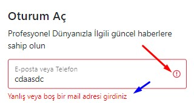

Bize dönecek olan hata mesajı için div tagı oluşturumuştuk. Bu div tagına **inserADjacentHTML(beforeend)**  özeliğini kullanarak input tagımız altına konumlandırıyoruz. 

```javascript
 const dıv = document.querySelector('.denım')

  dıv.insertAdjacentHTML("beforeend", alert)
```

Oluşturmuş olduğumuz hata mesajı bize belli bir saniye boyunca gözekecek. Belli bir saniyeden sonra bize hata mesajı gösterilmeyecek. Bunu için 2 tane setTimeout oluşturuyoruz. SetTimeout özeliği ile bu hata mesajları bize 3 saniye gösterilecek 3 saniye sonra hata mesajı ortadan kalkacak. SetTimeout ile ilk önce alert değişkeni içreinde tanıladığımız invalid-feedback classsını kaldırıyoruz.  Daha sonrada bir settimeout özelliği oluşturarak input içine setAttribute ile form-control classını ekliyoruz.

```javascript
    setTimeout(() => { document.querySelector(".invalid-feedback").remove() }, 3000)
    
    setTimeout(()=>{inp.setAttribute("class","form-control")},3000)
```

 Bu komutlar biz  butona tıklandığımızda çalışacak

Oturum açım butonuna tıkladığımızda yazmış olduğumuz if-else karar komutunu kontrol edecek ve ben eğer mail alanına boş veya mail standardına uygun olmayan bir mail adresi girdiysek bize  **yanlış veya boş bir mail adresi girdiniz ** yazısını döndürecek (burda regex.test(email)==false burda email kutusu içine girilen mail adresi bu standartlara uygun değilse hata mesajı gönder).

` ui.errorAler('Yanlış veya boş bir mail adresi girdiniz', 'warning')` burada errorAler fonksiyonunu çağırıyoruz. Bu işlemler sonucunda yazdığımız kodlar bu şekilde gözükecek.

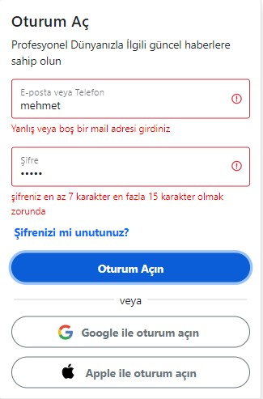


```javascript
const ui = new UI()
ui.btn1.addEventListener('click', function () {

    const email = document.getElementById('floatingInput').value;
    var regex = /^[a-zA-Z0-9._-]+@([a-zA-Z0-9.-]+.)+([.])+[a-zA-Z0-9.-]{2,4}$/;
    if (email === '' || regex.test(email) == false) {
        // input.className='form-control is-invalid';
        ui.errorAler('Yanlış veya boş bir mail adresi girdiniz', 'warning')

    else {

        ui.successAlert('Email adresi geçerli', 'success');

         ui.btn_start1.classList.add('active')
     ui.btn_start.classList.add('d-none')
        // // ui.btn_start.remove('div')

    }
});
```


```css
 ui.btn_start1.classList.add('active') 
 
 //css
 .btn-start1{
    opacity: 0;
    pointer-events: none;
    
}

.btn-start1.active{
    opacity: 1;
    pointer-events: auto;
}

```

Butona tokladığımızda oluşturmuş olduğumuz aktif classını **.btn_start1** classına aktaracak .Ben bu classa tıkladığımızda **.btn1_start1** classına sahip olan alan aktif görünür hale gelecek.Bu alanı görünür hale getirmek içinde **opacity:1;** metodunu kullandık *([btn_start1 classı bizim anasayfamıza giden yol ])*.


Eğer girilen mail adresi ve şifre doğru ise kullanıcı sayfasına bağlanacağız.

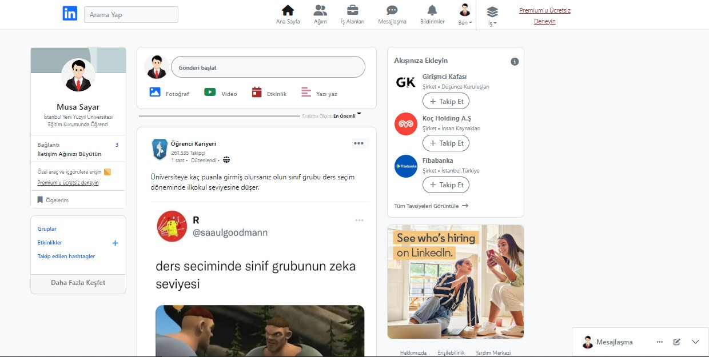

Ayrıca biz Anasyfamız da iken mouse'un  sol tuşuna basıp  incele dersek bizim kendi yazmış olduğumuz div tagı eklenmiş olacak;

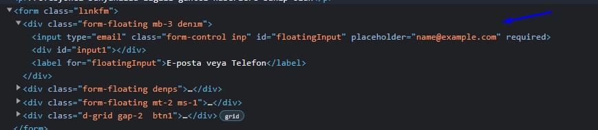

### A.2 Password:

 E-mail alanımızı oluşturduktan sonra password alanımızı oluşturuyoruz. Biz burada şifremizi girerken bir kontrol yapılmasını istiyoruz. Biz password alanına boş veya 7 karakterden az ve 15 karakterden fazla karakter girdiğimizde bize bir hata mesajı döndersin. Bu hata mesajı için errorPassword adlı bir fonksiyon oluşturuyoruz oluşuturuyourz. Bu fonksiyon dışarıdan bir tane message parametresi alacak. Bu hata mesajı için biir div tagı oluşturuyoruz. Bu div tagı içine invalid-feedback classını ekliyoruz. Bu div için bize dışarıdan gelecek olan message parametresini ekliyoruz. Bu div etiketini de alert adlı değişken içerisine aktrıyourz Daha sonra bir input değişkeni tanımlayıp bu input classına bana hata mesajı döndürüldüğünde password alanın kırmızı renk olması için is-invalid classını ekliyoruz. ('.denps') classına sahip olan eleman içine de bana mesajını göstermesi için bir beforeend komutunu ekliyoruz.

```javascript

UI.prototype.errorPasword = function (message) {
    var alert = `<div id='linkps'  class='invalid-feedback' style="color:red">${message}</div>`


  input = document.querySelector('.inps')

    input.classList += 'form-control is-invalid'
    const dıv1 = document.querySelector('.denps')
    dıv1.insertAdjacentHTML("beforeend", alert)

    setTimeout(() => { document.querySelector(".invalid-feedback").remove() }, 3000)
    setTimeout(()=>{input.setAttribute("class","form-control")},3000)
}

```

Biz butona tıkladığımızda bu kodlar çalışmaya başlayacak. 

**const password = document.getElementById('floatingPassword').value.length;** password diye bir değişken tanımlıyoruz. Bu değişken bana password içine girilen değerin length özelliği ile karakter sayısını getirecek.

```javascript
`else if(password==='' || password<=7 || password>=12){
        ui.errorPasword('şifreniz en az 7 karakter en fazla 15 karakter olmak zorunda','warning')
    }` 
```

eğer password alanına girilen değer boş veya 7 den küçük yada 7'ye eşitse veya 15'den büyük veya eşitse bana **  ui.errorPasword**  fonksiyonunu çağırarak hata mesajını gösterecek.

```javascript
ui.btn1.addEventListener('click', function () {

 const password = document.getElementById('floatingPassword').value.length;
	if (...){
        ...
    } else if(password==='' || password<=7 || password>=12){
        ui.errorPasword('şifreniz en az 7 karakter en fazla 15 karakter olmak zorunda','warning')
    }
    else {
        ui.successPasword('şifreniz geçerli','success');
         ui.btn_start1.classList.add('active')
     ui.btn_start.classList.add('d-none')
        // // ui.btn_start.remove('div')
    }
})
```


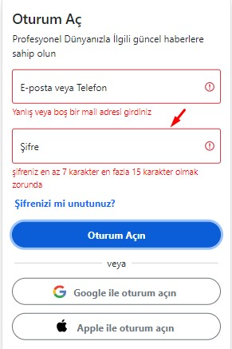

Password alanına 7 karakter ile15 karakter arasında bir sayı girdiğimizde ve oturum aç butonuna tıkladığımızda bize şifreniz geçerli bilgisini döndürecek ve bizi ana sayfaya yönlendirecek. 

Özetlemek gerekirse LınkedIn'e kayıt olup giriş yapmak istediğimizde LınkedIn bizden kayıt olurken kullandığımız mail adresini ve şifreyi ister. Ben de giriş alanında istenilen bu bilgiler üzerinde öğrendiğim javascript kodları üzerinden bir takım işlemler yaparak oluşturduğum giriş alanına işlevsellik kattım.


## Giriş ve Ana Sayfa Bölümlerinin Tasarlanışı;

### Giriş Alanı; 

Giriş Alanını oluştururken  ilk kısımda   div tagı altında  2 tane container  classı tanımlıyoruz ilk contianer classı içinde  row yapısı altında col-10'luk sistem içinde **LınkedIn **  yazısını oluşturduk.

```html
  <div class="btn-start">

    <div class="conatiner">
      <div class="row">
          <div class="col-10 mt-5 ms-5"> <h3><span class="fw-bold text-primary "> Linked<i class="fa-brands fa-linkedin w3-xlarge"></i><span></h3></div>
   
      </div>
     </div>
   
```

Yukardan (mt-5 ) ve soldan (ms-5) vererek LınkedIn yazısının sayfa içindeki konumunu belirtiyoruz. Linked yazısının yanında da  font awesome vererek lınked'ın yanına in iconu yerleştiriyoruz.


İlk container alanımızda LınkedIn yazsını oluşturduktan sonra . 2. Container alanımıza geçiyoruz bu container içinde de Oturum Aç bölümünü oluşturmuştuk. Oturum aç kısmını row yapısı altında card classını kullanarak oluşturmuştk.Cardımzı oluştururken de belli css'leri yazarak cardın konumunu sayfanın ortasına getirdik. Aşağıdaki kodlarla cardımızı sayfanın ortasına konumlandırdık.

```css
.btn-star{
    box-sizing: border-box;
    margin: 0;
    padding: 0;
}

.lınked{
	display: flex;
	align-content: center;
	justify-items: center;   
}

```


Card içinde de e-mail,password ve button yapılarını <form></form> etiketi altında <input> tagları içinde tanımlıyoruz. Input tagı içinde a href elamanı altında p taglerı içinde kullanıcıya yardımcı olmak için şifrenizi mi unutunuz diye bir bildiri  metni ekliyoruz. Kullanıcı bu yazıya tıkladığında yeni bir şifre oluşturma sayfasına gidecek

```html
 <div class="form-floating mt-2 ms-1">
        <a  class="text-decoration-none" href="#"><p class="fw-bold">Şifrenizi mi unutunuz?</p></a>
 </div>
  
```

```html
  
     <div class="container lınked mt-5" >
      <div class="row ">
          <div class="card  shadow p-3 mb-5 bg-body rounded" style="width: 24rem;">
              <h4>Oturum Aç</h4>
              <p>Profesyonel Dünyanızla İlgili güncel haberlere sahip olun</p>
               <form class="lınkfm" >
                  <div class="form-floating mb-3 denım">
                     <input type="email" class="form-control inp" id="floatingInput" placeholder="name@example.com" required>
                     <div id="input1"></div>
                    <label for="floatingInput" >E-posta veya Telefon</label</div>
                    <div class="form-floating denps">
                      <input type="password" class="form-control inps" id="floatingPassword" placeholder="Password" required>
                      <div id="input1"></div>
                      <label for="floatingPassword">Şifre</label>
                    </div>
                    <div class="form-floating mt-2 ms-1">
                      <a  class="text-decoration-none" href="#"><p class="fw-bold">Şifrenizi mi unutunuz?</p></a></div>
                    <div class="d-grid gap-2  btn1">
                      <button type="button" class="btn btn-primary mt-1 color  rounded-5 p-2"  href="index.html"><span class="   fw-bold"> Oturum Açın</span> 
                      </button>
                    </div>
 
               </form>
```

Form alanımı alnını oluşturduktan sonra şöyle bir çıktı elde ettim;

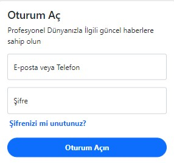

Form  alanı dışına çıkar iki tane daha button tanımlıyoruz. Bu butonlar Google ile oturum aç ve Apple ile oturum aç. Bu butonları oluştururken yazıların yanlarındaki iconları Gerçek LınkedIn'ın kendi sayvasından *svg*'lerini alıyoruz.

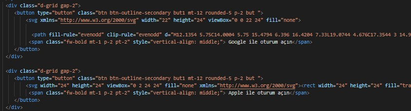

Bu butonları da ekledikten  sonra sayfam şu şekilde görünmeye başlayacak.

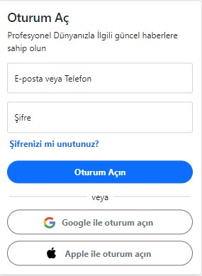

Bu iki butonu da oluşturduktan sonra  oluşturduğumuz card yapısı içinden çıktıktan sonra hemen kartın altında kullanıcıya LınkedIn da yenimisiniz. Hemen Katılın diye bir <p></p> tagları içinde yazı oluşturuyoruz. Bu yazımızı oluşturduktan sonra da footer tagı oluşturuyoruz . Site için bir alt bilgi alanı tanımlıyoruz. Footer alanımızı oluştururken ul tagı altında li taglarını kullanıyoruz. Ul içinde ** <ul class="list-inline-item list-group list-group-horizontal list-unstyled">** classlarını tanımlayarak li taglarımızızn alt alta değil yan yana gelmesini sağlıyoruz list-unstyled classıyla li etiktlerinin başında bana herhang bir madde imi göstermemesini sağlıyoruz. Ayrıca li taglları içinde yazılarımı a href'ler içine yazarak bu yazılara işlevsellik kattım yani kulanıcı *Gizliliik Politikası* üstüne mouseyle gidip tıkladıktan sonra gizlilik politikası sayfamıza ulaşmış olacak.

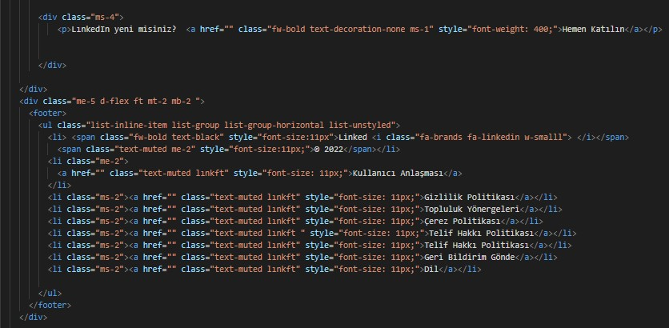

Footer alanımızı da oluşturduktan sonra bizim giriş sayfası alanındaki işlerimiz bitmiştir. Bu kodları yazdıktan sonra şöyle bir görüntü elde etmiş olacağız.

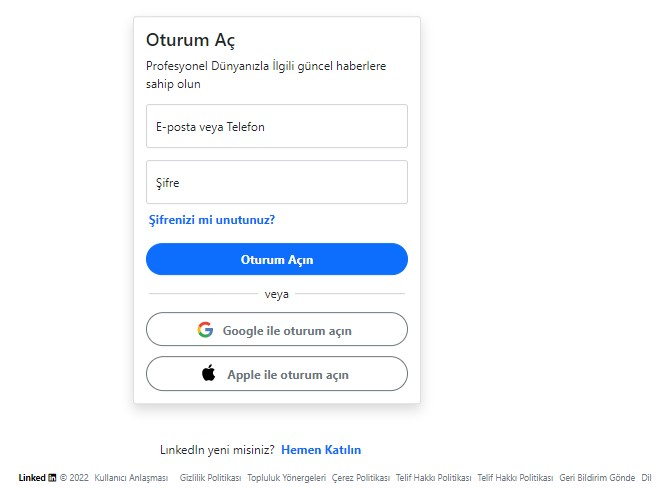

### Ana Sayfa  Tasarlanışı: 

Ana Sayfa alanını  tasarlarken genel yapıyı <div class="btn-start1"></div> kodu altında oluşturuyoruz. Bu div altında yani btn-start1 classı altında 3 ayrı div tagı daha tanımlıyoruz. 

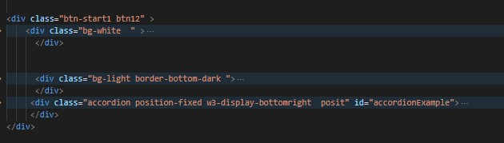

Birinci div etiketi içinde bg-white classına sahip olan kısımda container yapısı altında navbar (menü çubuğunu)  oluşturuyoruz. Navbar  alanını container classı altında nav etiketi içinde container-fluid classı altında tanımlıyoruz. Nav etiketi altında öncellikle *LınkedIn'nın In* yazısını icon şeklinde navbar çubuğumun sol tarafına a href classı içinde ekliyoruz.

```html
  <a class="navbar-brand" href="#"><i class="fa-brands fa-linkedin text-primary ms-5 w3-xxlarge"></i></a>
  
```

```html
<div class="btn-start1 btn12" >
    <div class="bg-white  " >
        <div class="container">
          <nav class="navbar navbar-expand-lg bg-white " style="height:65px ;">
            <div class="container-fluid">
              <a class="navbar-brand" href="#"><i class="fa-brands fa-linkedin text-primary ms-5 w3-xxlarge"></i></a>
              <button class="navbar-toggler" type="button" data-bs-toggle="collapse"
                data-bs-target="#navbarSupportedContent" aria-controls="navbarSupportedContent" aria-expanded="false"
                aria-label="Toggle navigation">
                <span class="navbar-toggler-icon"></span>
```

In ıconumu ekledikten sonra menü çubuğu içinde yer alacak olan arama alanımı oluşturmak için form etiketi altında input etiketi oluşturarak bunu tipini de (type) search olarak ayarlıyoruz.LınkedIn'da istediğim sayfalara veya kişilere bu arama alanı içinden ulaşabileceğim. Arama butonunu oluşturduktan sonra da ana sayfa, mesajlaşma,ağım,ilanı  bildirimler ve ben (profil butonu) alanlarını oluşturmak için navbar-collapse classı altında ul tagıiçinde li tagları oluşturuyoruz. Li taagları içinde ilk önce ana sayfa alanımızı oluşturuyoruz. Ana sayfa alanını oluştururken *font awesome*'dan yararlanarak home iconu ekliyoruz. Daha sonrada li tagları içinde diğer alanlarımızı oluşturarak onlar içine de <i></i> içinde iconlar ekliyoruz.

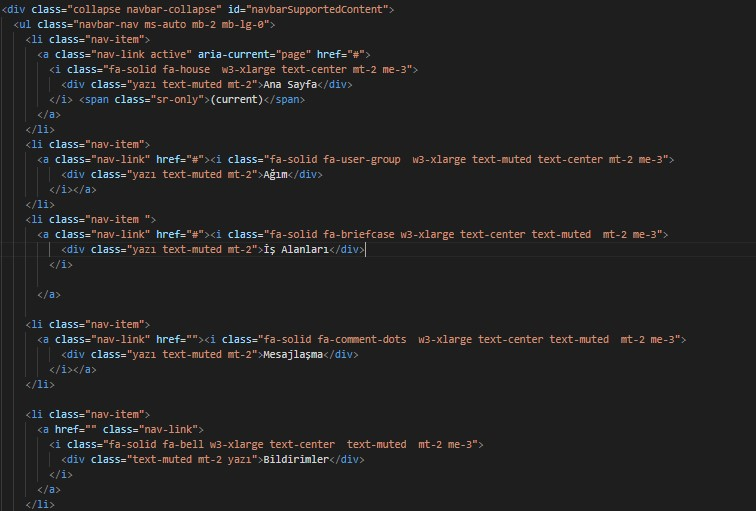

 En sonda bildirimler alanımızı oluşturduktan sonra ben(profil) alanımızı oluşturuyoruz. Profil alanımızı oluştururken dropdown classından yararlanıyoruz. Kişi gelip ben alanına tıkladığında bir dropdown açılacak.

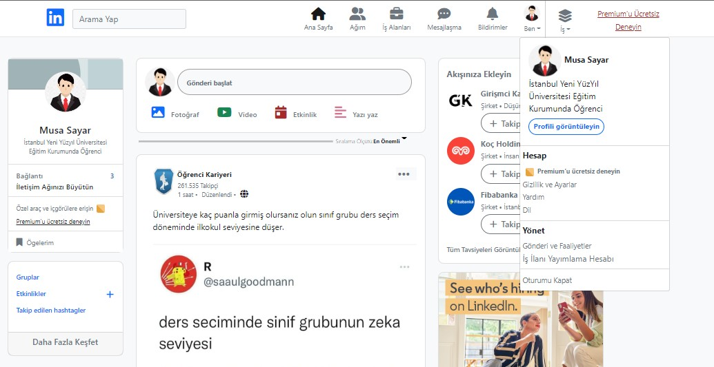

Açılan bu dropdown içinde kullanıcının kısmı bilgilerini içeren bir dropdown menu oluşturuyoruz. Kullanıcı içinde kendi profilini görüntülemesi için bir button oluşturuyoruz.

```html
   <li class="dropdown border-2  nav-item mt-1">
                    <a class="nav-link toggle " href="#" role="button" data-toggle="dropdown" aria-expanded="false">
                      
                      <div class="text-center dropdown-toggle  yazı text-muted mt-1 ">Ben</div>
                    </a>
                    <div class="dropdown-menu ">
                      <div class="dropdown-item-text  mb-3" style="width: 270px;">
                        <a href="#" class="text-dark text-decoration-none">
                          
                          <span><strong>Musa Sayar</strong><br>İstanbul Yeni YüzYıl <br>Üniversitesi Eğitim <br>Kurumunda
                            Öğrenci</span>
                        </a>
                        <button type="button"
                          class="btn btn-outline-primary w3-hover-pale-blue profil btn-sm mt-2 rounded-4"><span>Profili
                            görüntüleyin</span>
```

Sonrada hesap ve yönet alalanlarını da dropdown içine ekliyoruz. Hesap alanını oluştururken ul tagı altında li tagları tanımlıyoruz.  Daha sonrada yönet alanını da ul tagıalında li tagları altında oluşturuyoruz. Burada hesap alanını oluşturuken Gizlilik ve Ayarlar, Yardım ve Dil bunları li elemanları için de a etiketi içinde href özelliği ile bu sayfalara ulaşma yetkisi veriyoruz. Kullanıcı bunlardan birine gelip tıkladığında ilgili sayfaya yönlendirilecek.Aynı yapıyı yönet alanı içinde oluşturuyoruz.

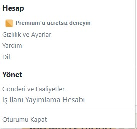

```html
<div class="dropdown  mt-2">
                        <h6 class="ms-1 text-dark fw-bold">Hesap</h6>
                        <ul class="list-unstyled">
                          <li class="ms-2"><a class="text-muted small text-dark text-decoration-none fw-bold" href=""> <svg
                                xmlns="http://www.w3.org/2000/svg" viewBox="0 0 24 24" data-supported-dps="24x24"
                                class="mercado-match" width="20" height="20" focusable="false">
                                <path d="M20 20a3.36 3.36 0 001-2.39V6.38A3.38 3.38 0 0017.62 3H6.38A3.36 3.36 0 004 4z"
                                  fill="#f8c77e"></path>
                                <path d="M4 4a3.36 3.36 0 00-1 2.38v11.24A3.38 3.38 0 006.38 21h11.24A3.36 3.36 0 0020 20z"
                                  fill="#e7a33e"></path>
                              </svg><span class="small text-dark text-muted">
                                Premium’u ücretsiz deneyin
                              </span></a></li>
            <li class="ms-1"><a class="text-muted small " href="">Gizlilik ve Ayarlar</a></li>
                          <li class="ms-1"><a class="text-muted small e" href="">Yardım</a></li>
                          <li class="ms-1"><a class="text-muted small " href="">Dil</a></li>
                        </ul>
                      </div>
                      <div class="dropdown-divider"></div>
                      <h6 class="ms-1 fw-bold  text-dark">Yönet</h6>
                      <ul class="list-unstyled">
                        <li class="ms-1"><a href="" class="text-dark small text-muted ">Gönderi ve Faaliyetler</a></li>
                        <li class="ms-1"><a href="" class="text-dark text-muted ">İş İlanı Yayımlama Hesabı</a></li>
                        <div class="dropdown-divider"></div>
```

En sonda da Yönet alanı içinde li elemanı içinde oturumu kapat alanını oluşturuyoruz. Kullanıcı gelip oturumu kapata tıkladığında oturumu kapatılacaktır.

Ben(profil) alanını da oluşturduktan sonra da yukardan bir çizgi çekerek iş ve premiumu ücretsiz deneyin alanlarını oluşturuyoruz. İş ve premiumu ücretsiz deneyin bildirimlerini oluştururken diğer bildirimlerden ayırmak için **w3-border-left ** classı ile aralarına bir çizgi çektim. Navbar menü alanımı oluşturduktan sonra  şu görüntüye ulaşıyoruz.

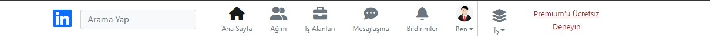


Ayrıca biz iş alanına da  dropdown özelliği ekliyoruz. İş alanına tıkladığımızda dropdown açılacak ve bana bir card içinde *Diğer Lınkledın Ürünlerini Ziyaret Edin* şeklinde bir alan gelecek. Ben bu alanı oluştururken ul tagı altında li taglarından yararlanıyoruz. Her bir li tagı diğer lınkedın ürünlerini yerleştiriyoruz ve lınkedın ürünlerinin iconlarını Lınkedın orjinal sayfasından svglerini alıyoruz.

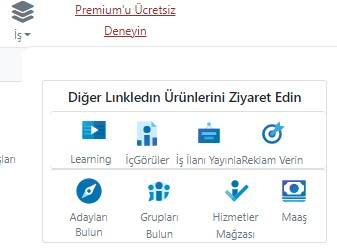


İş alanı içine bir de lınkedIn'nın ticari hizmetler alanını ekliyoruz. Kullanıcı buraya gelip istediği ticari hizmeti seçebilecek. Bu ticari hizmetler alanını da card içinde ul tagı altında li tagları içinde a href özelliğini kullanarak. Bunların a class içinde *w3-hover-opacity* vererek mouse ile yazı üzerine gittiğimizde yazı opaklık ekledim. <h6></h6> etiketi içinde başlık tanımlayarak <p></p> etiketi ile de başlık tanımları altında o başlıklarla ilgili bilgi veriyoruz. Başlıkları *fw-bold* classı ile kalınlaştırıyoruz.  Paragraflarda *text-mute* özelliğini ekliyoruz.

Biz İş alanına tııkladığımızda bize açılacak olan pencere sayfanın sağ tarafında gösterilecek. Bu alanın ekranın sağ tarafında gösterilmesi için job ve slide adlı iki class sınıfı oluşturuyoruz.  Bu alan bize ilk başta gösterilmeyecek ne zamanki biz iş alanına tıkladığımızda açılır pencere ile bu alan bize gösterilecek. Bunun için başta bu alanın (*width=0*) genişliğine 0 veriyoruz. Biz iş alanına tıkladığımızda bizim açılır penceremizin genişliği 380px olacak ve kullanıcıya bu alan gösterilecek. Kullanıcı gelip çarpı ikonuna tıkladığında bu açılır pencerenin genişliği geri 0 olacak.


```css
  .job{
    height: 100%;
    width: 0;
    position: fixed;
    z-index: 1;
    top: 64px;
    right: 0;
    overflow-x: hidden;
    transition: all 0.4s;
    padding-top: 10px;
    padding-bottom: 60px;
    background-color: #fff;
    border-radius: 12px;
    border: none;
    border-top:1px solid rgba(230,230,230,1)
  }
	const openSlide = document.querySelector(".slidem");
	const closeSlide= document.querySelector(".btn-close");
 	openSlide.addEventListener("click", () =>{
    document.querySelector(".job").style.width = "380px"})
	closeSlide.addEventListener("click",() =>{
    document.querySelector(".job").style.width = "0"})


```

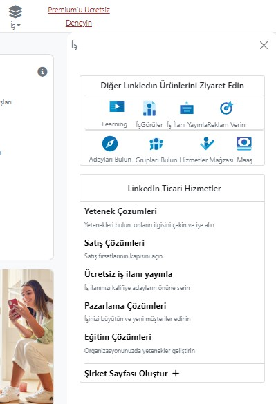

```html
 <div class="card mt-3 me-4 ms-4 mb-4">
  <h6 class="text-center mt-3 ms-2">LinkedIn Ticari Hizmetler</h6>
    <div class="dropdown-divider"></div>
     <ul class="list-unstyled ms-2  ">
      <li> <a class="lınk  w3-hover-opacity" href="#" style="font-size: 11px; ">
       <h6 class="text-dark fw-bold">Yetenek Çözümleri</h6>
        <p class="text-muted">Yetenekleri bulun, onların ilgisini çekin ve işe alın</p></a></li>
      <li>  <a href="" class="   w3-hover-opacity" style="font-size: 11px;">
        <h6 class="text-black fw-bold"> Satış Çözümleri </h6>
          <p class="text-muted">Satış fırsatlarının kapısını açın</p></a> </li>
       <li> <a href="" class="w3-hover-opacity" style="font-size: 11px;">
         <h6 class="text-black fw-bold"> Ücretsiz iş ilanı yayınla</h6>
             <p class="text-muted">İş ilanınızı kalifiye adayların önüne serin</p> </a></li>
       <li>  <a href="" class=" w3-hover-opacity" style="font-size: 11px;">
          <h6 class="text-black fw-bold"> Pazarlama Çözümleri </h6>
              <p class="text-muted">İşinizi büyütün ve yeni müşteriler edinin</p> </a></li>
        <li><a href="" class="  w3-hover-opacity" style="font-size: 11px;">
           <h6 class="text-black fw-bold">Eğitim Çözümleri</h6>
               <p class="text-muted">Organizasyonunuzda yetenekler geliştirin</p> </a></li>
           <div class="dropdown-divider"></div>
    
         <li> <a class="  w3-hover-opacity" style="font-size:13px" href="#">
            <h6 class="text-black fw-bold ">Şirket Sayfası Oluştur <i class="fa fa-plus ms-1" aria-hidden="true"></i></h6>
    
           </ul>
              </div>
    
```

Bu Kodların çıktısı;


LınkedIn ana sayfa tasarımında navbar (menü çubuğunu) oluşturduktan sonra ana sayfamın gönderilerin olduğu alanı tasarlamaya geldi. Bu alanı  div içinde arka planına light classı vererek başladım. 

```html
              <div class="bg-light border-bottom-dark "></div>

```

Ana sayfamda gönderiler alanını  div altında container  yapısı altında row classı içinde 3 colon halinde tanımlıyoruz. Alanımı col-3,col-5,col-3 şeklinde 3 colona bölüyoruz. 

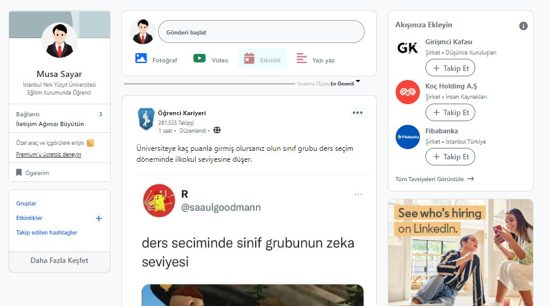

İlk kolonumda col-3 yapısı içinde kullanıcı için olanı tasarlıyoruz.Bu col-3 alanının genişiliğini *width:15rem* olarak ayarlıyoruz. Bu alanda kullanıcının resmi, adı, soyadı, okul bilgisi, bağlantıları ve öğlerini içeren alanı card yapısı içinde oluşturuyoruz. Burada card'ın genişliğini *width:14rem* olarak ayarlıyoruz. Card yapısını oluşturduktan sonra resmin bulunacağı ayarlamak için card-header kullanıyoruz. Card-header altında *card-img-top, rounded-circle,text-center,mt-3 ve mb-3* classlarını kullanarak resmi card içinde ortaladım ve resmi yuvarlak hale getiriyoruz resmin genişliğine de *width=75px* yüksekliğini de *height=75px* olarak ayarlıyoruz. Card header alanında resmin arka planında bulunan açık mavi rengi ayarlama içinde **LınkedIn** kendi sayfasında bulunan arka plan renginden yararlanıyoruz.

 

```css
 .arka {
      background-image: url(ımg/lınkledın.svg);
      background-position: center;
      background-size: cover;
      height: 56.25px;
      margin: -129x -12px 0;
    }
```

Card-header alanımı oluşturduktan sonra da ad, soyad, okul ve diğer  bilgilerin bulunduğu alanı card-body içinde oluşturuyoruz. Burada kullanıcının adının ve soyadının bulunduğu alanı a href classı içinde tanımlayarak kullanıcı için profile bir bağlantı yolu oluşturuyoruz. <p></p> etiketi içinde de kullanıcının okul bilgisini tanımladım.

```html
      <div class="card-body text-center mt-5">
                  <a href="#" class="card-text text-dark w3-hover-opacity arka2 mt-5  ">Musa Sayar</a>
                  <p class="card-text text-muted " style="font-size:11px;">İstanbul Yeni Yüzyıl Üniversitesi Eğitim
                    Kurumunda Öğrenci</p>
                </div>
```

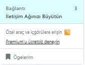

Daha sonra da bağlantı,özel araç ve iç görülere erişin  ve öğelerim alanını ul tagı altında li tagları içinde oluşturuyoruz. 

```html
  <ul class="list-group list-group-flush">
                  <li class="list-group-item w3-hover-pale-blue">
                    <a href="" class="w3-hover-opacity ">
                      <span class="text-muted yeni2">Bağlantı <span class="float-end mt-1 view"
                          style="color:#0a66c2">3</span>
                        <div class="  text-dark">İletişim Ağınızı Büyütün</div>
                      </span>
                    </a>
                  </li>
                  <li class="list-group-item w3-hover-pale-blue">
                    <a href="#" class="w3-hover-opacity text-decoration-none">
                      <span class="text-muted " style="font-size: 11px;">Özel araç ve içgörülere erişin</span>
    
                      <svg xmlns="http://www.w3.org/2000/svg" viewBox="0 0 24 24" data-supported-dps="24x24"
                        class="mercado-match" width="20" height="20" focusable="false">
                        <path d="M20 20a3.36 3.36 0 001-2.39V6.38A3.38 3.38 0 0017.62 3H6.38A3.36 3.36 0 004 4z"
                          fill="#f8c77e"></path>
                        <path d="M4 4a3.36 3.36 0 00-1 2.38v11.24A3.38 3.38 0 006.38 21h11.24A3.36 3.36 0 0020 20z"
                          fill="#e7a33e"></path>
                      </svg><span class=" text-dark w3-hover-text-blue text-decoration-underline"
                        style="font-size:11px; font-weight: 400;">
                        Premium’u ücretsiz deneyin
                      </span>
                    </a>
                  </li>
    
                  <li class="list-group-item w3-hover-pale-blue">
                    <a href="#" class="text-dark w3-hover-opacity text-decoration-none  text-muted">
                      <i class="fa fa-bookmark w3-hover-opacity text-decoration-none me-2 " aria-hidden="true"></i><span
                        style="font-size:12px;">Ögelerim</span></a>
                  </li>
                </ul>
```

Bu alanımızı yukardaki kodlardan yararlanarak oluşturduktan sonra col-3 içinde yeni bir card yapısı tanımlıyoruz.  Bu card altında card-body içinde ul tagı oluşturuyoruz ve ul etiketi altında  gönderiler,etkinlikler, takip edilen hashtagleri sayfalarını li tagları içinde sırasıyla oluşturuyoruz. Card içinde card-body alanımı oluşturduktan sonrada bir card-footer kullanıyoruz. Bu card-footer içinde a href etiketini kullanarak daha fazla keşfet diye bir seçenek tanımlıyoruz. Bu alanı da oluşturduktan sonra col-3 kolonu içinde şöyle bir görüntü elde ediyoruz;

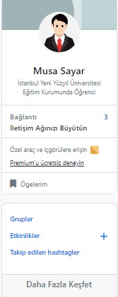


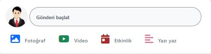

Bu yapıyı oluşturduktan sonrada kullanıcının gönderi paylaştığı ve gönderilerin olduğu alanı col-5 yapısı içinde tanımlıyoruz. Col-5 kolonun genişiliğini *width:15rem* olarak ayarlıyoruz. Col-5 içinde kullanıcının  gönderi başlat alanını ise card içinde tanımlıyoruz. Bu cardın genişliğini de *width:35rem* ayarlıyoruz. Burada cardı oluşturduktan sonra card içinde card-body oluşturuyoruz. Card-body içinde kulanıcının resminin olduğu alanı img özelliği ile oluşturuyoruz ve gönderi başlat diye de bir button oluşturuyoruz. Buttonu oluşturduktan sonra kullanıcı için fotoğraf, video ,etkinlik ve yazı yaz alanlarını oluşturuyoruz. Bu alanları ul etiketi içinde *list-group list-group-horizontal list-unstyled* classlarını tanımlayarak   oluşturuyoruz ve böylelikle li taglarının yan yana görünmesini sağlıyoruz.

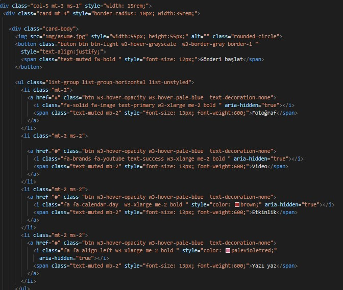

Her  bir li elemana a etiketi içinde fotoğraf, video, etkinlik ve yazı yaz alanları için ayrı ikonlar tanımlıyoruz. a tagı içinde de ikonların altına gelecek şekilde ikonu temsil eden yazılar ekliyoruz. a etiketinin classına btn vererek onu buton haline getiryoruz. w3-hover-opacity ve w3-hover-pale-blue özelliğini kullanarak butona opaklık ve renk  ekliyoruz. Fare ile butonun üzerine gittiğimiz de buton daha belirgin hale gelecek. Aşağıdaki resimde fare il buton üzerine gittiğimizde butondaki farklılığı göreceksiniz.

Yukarıda gönderi başlat alanını yazılmış kodları bulunmaktadır. Gönderi başlat alanını oluşturduktan sonra col-5 içinde ayrı bir div tagı  içinde d-flex classı oluşturuyoruz. Bu d-flex altında div içinde bir dropdown tanımlıyoruz. Dropdown içine de buton tanımlıyoruz butona tıkladığımızda bize bir alan açılacak bu alana göre en önemli ve en yeniler diye iki seçenek çıkacak. Biz bu alana  sayfamızda filtreleme yapacağız.

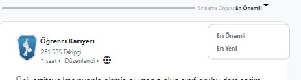

Filtreleme alanımı da oluşturduktan sonra gönderi alanlarını oluşturuyoruz. Bu alanı card içinde tanımlıyoruz bu kartın genişliğine 35 rem veriyoruz *width:35rem;*  *border-redius:10px* vererek kenarlarını yuvarlatıyoruz.  Oluşturduğumuz card altında bir card-header tanımlıyoruz. Bu card-header içinde gönderi paylaşan kişinin resmini img tagı içinde oluşturuyoruz. Kişinin adını ve gönderiyi ne zaman paylaştığında dair bilgileri veriyoruz. Kişinin resmini  ve bilgilerini oluşturduktan sonra da img etiketi altında ayrı bir div içine dropdown ekliyoruz. Bu dropdown  içinde a tagını oluşturuyoruz. Oluşturduğumuz bu a elemanı içine de ellipsisi ikonunu ekliyoruz. Bu ikonu Kişinin bilgileriyle aynı hizada olacak şekilde cardın sağ tarafına float-end classıyla konumlandırıyoruz.

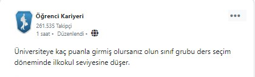

Bu ikona gelip tıkladığımızda bize bir dropdown menüsü açılacak. Bu dropdown menüsünü oluştururken de ayrı ayrı a tagları oluşturuyoruz. Bu taglar içinede dropdown-item classını ekliyoruz.   a taglar içine de ikonlar ekliyoruz. Ben bu açılan menü içinde o sayfayla ilgili  yapabileceğimiz seçenekleri göreceğiz.

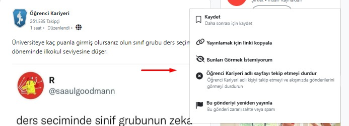


Ellipsis alanını oluşturduktan sonrada gönderi gönderiyi oluşturuyoruz. İmg etiketini kullanarak resim ekledim resmin genişliğine **width:700px; height:500px;** vererek resmi card-header içinde konumlandırıyoruz. Card-header içine gönderiyi yükledikten sonra beğeni ve yorum sayısını ul tagı içinde li tagı altında oluşturuyoruz. Li tagı içinde img tagı tanımlıyoruz beğeniyi gösteren svg'ler tanımlıyoruz. Bu svg'leri lınkedının kendi sayfasından alıyoruz. Tekrar bir li elemanı açarak yorum sayısını span içinde gösterdik.

```html
<li> 
   
   
   <span class="w3-hover-text-blue text-muted kar">117</span>
</li>
<li class="list-inline-item smaal mb-2 float-end">
   <span class="w3-hover-text-blue text-muted kar small">1 Yorum</span>
</li>      
```

Yeni bir div açarak bu div altında da ul tagı altında li tagları içinde a etiketine btn özeliği katarak beğen, yorum yap, yeniden düzenle ve paylaş alanlarını oluşturduk. Bu alanlara a tagı içinde ayrı ayrı içeriklerine uygun ikonlar ekliyoruz. 

```html
 <div class="">
        <ul class="list-group list-group-horizontal list-unstyled ms-3">
                      <li class="me-2 mt-2">
                          <a class="btn w3-hover-opacity w3-hover-pale-blue text-decoration-none small" href="">
                            <i class="fa-regular fa-thumbs-up w3-large text-muted me-1" aria-hidden="true" ></i>
                            <span class="text-muted" style="vertical-align: top; font-size: 11px; font-weight: 600;">Beğen</span>
                          </a>
                        </li>
                        <li class="mt-2  me-2">
                          <a class="btn w3-hover-opacity w3-hover-pale-blue text-decoration-none small" href="">
                            <i class="fa-regular fa-comment-dots w3-large text-muted me-1" aria-hidden="true" ></i>
                            <span class="text-muted" style="vertical-align: top; font-size: 11px; font-weight: 600;">Yorum</span>
                          </a>
                        </li>
                        <li class="mt-2 me-2">
                          <a class="btn w3-hover-opacity w3-hover-pale-blue text-decoration-none small" href="">
                            <i class="fa-solid fa-arrows-rotate w3-large text-muted me-1" aria-hidden="true" ></i>
                            <span class="text-muted" style="vertical-align: top; font-size: 11px; "> Yeniden Yayınla</span>
                          </a>
                        </li>
                        <li class="mt-2  me-2">
                          <a class="btn w3-hover-opacity w3-hover-pale-blue text-decoration-none small" href="">
                            <i class="fa-regular fa-paper-plane w3-large text-muted me-1" aria-hidden="true" ></i>
                            <span class="text-muted" style="vertical-align: top; font-size: 11px; font-weight: 600;">Gönder</span>
                          </a>
                        </li>
                      </ul>
        
                    </div>
```

Bu alanımızı da oluşturduktan sonra  gönderi alanı içini şöyle bir görüntüye ulaşıyoruz;


Bu gönderinin altına aynı biçimde iki tane gönderi ekliyoruz. Gönderi alanını da oluşturduktan sonra col-3 yapısı içinde son kolonumuzu oluşturuyoruz.

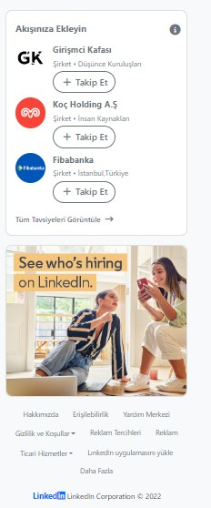

Col-3 yapısını oluştururken  genişliğini *width:16rem* soldan uzaklığını da *margin-left:300px* olarak ayarlıyoruz. Ayrıca *float-end* classını kullanarak da col-3 kolonumuzu ekranın sağ tarafına konumlandırıyoruz. Col-3 konumlandırma işleminden sonra hemen altında bir card tanımlıyoruz. Bu cardın genişliğini *width:20rem;* olarak ayarlıyoruz ve *border-radius:10px;* yaparak cardın kenarlarını yavarlattık. Bu card içinde bir card-body oluşturuyoruz. Bu card içinde akşımıza ekleyebileceğimiz yani şirketler ve kişiler keşfedebileceğimiz alanı oluşturuyoruz. Şirketler ve kişiler içinde bir takip et butonu oluşturduk. Bu kişiler ve butonu oluştururken bir ul tagı içinde li tagları tanımladık. Li tagı içinde de ilk olarak img tagları kullanarak kişinin resmini koyabileceği alanı oluşturuyoruz. İmg tagı içinde rounded-circle classını kullanarak da resmin görünümünü daire içine alıyoruz. Img'nin boyutunu da daire içine tam konumlandırmak için *width:50px; height:50px;* olarak ayarlıyoruz. Img oluşturduktan sonra da şirketin yada kişinin ismini yazdığı alanı a etiketi altında oluşturduk. Bu etiketi içinde *font-size:14px;*  ve *fw-bold* yaparak yazının boyutunu  ve kalınlığını ayaladık. A etiketini de oluşturduktan sonra p etiketini oluşturuyoruz. Bu tag içinde şirket veya kişi hakkında bir kaç bilgi ekliyoruz.

```html
  <p class="text-muted d-flex text-decoration-none w3-hover-opacity disabled" style="font-size:12px; margin-top:-25px; margin-left: 62px;"></p>
```

P etiketi altında bir buton oluşturuyoruz ve buton classını da *btn-outline-secondary* olarak ayalıyoruz. Butonun içinde de bir tane plus (+) ikonu ekliyoruz.

```html
       <button type="button" class="btn btn-outline-secondary" style="border-radius: 20px; font-weight:600; font-size:15px; margin-left:62px; margin-top:-12px;">
                  <i class="fa-solid fa-plus me-2 ms-1 " aria-hidden="true"></i>Takip Et
       </button>
```

Bu alanı oluşturup ul tagını kapattıktan sonrada  card-body tagını kapatmadan önce bir a tagı tanımlıyoruz. Bu tag içinde tüm tavsiyeleri görüntüle tanımlıyoruz. Bu a tagına gelip tıkladığımızda kullanıcı için tavsiye edilen diğer şirket ve kişileri gösterecek.


Tüm tavsiyeleri görüntüle alanını da oluşturduktan sonra card içinden çıkıyoruz. Yeni bir card tanımlıyoruz bu card içine de lınkedIn kendi sayfasından almış oluğumuz reklam resmini koyuyoruz.

```html
 <div class="card ms-4" style="border-radius: 10px; width:20rem;">
            
 </div>
```

Bu card alanımızı da oluşturduktan sonra sayfanın son alanı olan footer alanını oluşturuyoruz. Bu footer alanını col-3 yapısı altında oluşturuyoruz. Footer alanını ul tagı içinde li tagları altında a href bağlantı özelliğini kullanarak oluşturuyoruz.

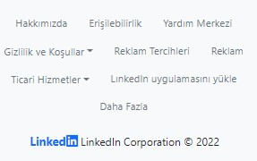


## MESAJLAŞMA ALANIN OLUŞTURULMASI

Mesaj alanını btn-strat1 classı altında oluşturuyoruz. Mesaj alanımız oluştururken accordion özelliğini kullanarak  oluşturuyoruz. Accoridon oluşturuken position-fixed özelliğni kulanarak sayfa hareket ettiğinde bu alanın sabit kalmasını sağladık. *w3-display-bottomright* diyerek mesajlajma alanını sayfanın sağ alt köşesine konumlandırdık. Id'sinede accordionExample verdik. 

```html
<div class="accordion position-fixed w3-display-bottomright  posit" id="accordionExample">
```

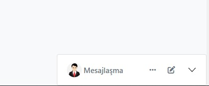

Accordion altında da accordion-item alanını oluşturuyoruz ve genişiliğini de *width:20rem* alarak ayarlıyoruz, arka plan renginide beyaz yapıyoruz *bg-white*. Mesajlajma alanımın genişliğini ve rengini ayarladıktan sonra h2 etkieti içinde accordion-header alanını oluşturuyoruz  ve id'sinede *id:heaOne;* veriyoruz.

```html
    <div class="accordion-item bg-white w3-hover-border-white w3-hover-white" style="width: 20rem;">
        <h2 class="accordion-header " id="heaOne">
```

h2 etiketi içinde bir button oluşturuyoruz bu butona tıkladığımızda mesajlajma alanı bana açılıp kapanacak.  Burada button içinde *data-toggle="collapse" data-target="#collapseOne" aria-controls="collapseOne"* attributelerini oluşturuyoruz. Bu attriubuteleri  dışarda oluşturduğumuz  div id=collapseOne ile ilişkilendiriyoruz. Biz buton tıkladığımızda bize ilişkilendirdiğimiz div altındaki veriler açılacak. Bu div altında accordion-body tanımlıyoruz. Bu accordion-body altında ise bir tane input ekiliyoruz. Eklediğimiz kullanıcı mesaj geçmişinde aramak istediği şeye buradan kolaylıkla ulaşabilecek. Daha sonra inputun yanında bir tane button tanımlıyoruz. Bu butonada dorpdown özelliği ekleyerek bir tane dropdown menü ekliyoruzçBu dropdown menü içinde kullanıcı için mesaj seçenekleri oluşturduk. 

```html
     <button class="accordion-button w3-small text-muted "  style="border-radius: 10px;"type="button" data-toggle="collapse" data-target="#collapseOne" aria-expanded="false" aria-controls="collapseOne">
            
            <span class="" style="font-size:15px; vertical-align: middle;">Mesajlaşma</span>
            
                   <div id="collapseOne" class="accordion-collapse collapse show " aria-labelledby="heaOne" data-parent="#accordionExample">
            <div class="accordion-body">
              <div class="input-group mb-2">
               <input type="text" class="form-control w3-light-gray"aria-label="Text input with dropdown button" placeholder="Mesajlarda ara">
               <div class="input-group-append">
                <button class="btn btn-light toggle dropstart" type="button" data-toggle="dropdown" aria-expanded="false"><i class="fa fa-sliders w3-medium"></i>
                <div class="dropdown-menu fw-bold">
                  <a href="" class="dropdown-item">Tüm Mesajlar</a>
                  <a href="" class="dropdown-item">Arşivlenenler</a>
                  <a href="" class="dropdown-item">Bağlantılarım</a>
                  <a href="" class="dropdown-item">Okunmayanlar</a>
                  <a href="" class="dropdown-item">Inmail</a>
                  <a href="" class="dropdown-item">İstenmeyen Posta</a>
                </div>
                </button>
```

İnput alanını oluşturduktan sonra gelen mesajların gösterildiği alanı oluşturuyoruz. Bu ldiv altında ul tagı oluşturarak li tagları altında tanımlıyoruz.  Bu li tagları içine resim ekleyebilmek için bir tane img tagı ekliyoruz. Resmin yanında isim alanını da p tagı içinde oluşturuyoruz. P tagı içinde span tagı  oluşturarak tarih bilgisini  span tagı  içine ekliyoruz. Ayrıca p tagı  içinde  **display: flex; align-items: center; justify-content: space-between; **" özelliklerini kullanarak isim ve tarih alanını sağ ve sol konuma konumlandırıyoruz. P altına yeni bir p tagı tanımlıyoruz. Bu p tagı içinde de kullanıcıya gelen mesaj veya gönderdiği son mesaj gösterilecek.


```html
  <button class="accordion-button w3-small text-muted "  style="border-radius: 10px;"type="button" data-toggle="collapse" data-target="#collapseOne" aria-expanded="false" aria-controls="collapseOne">html
```

Buton oluşturduktan sonrada kullanıcını resminin mesaj kutusu içinde gösterilmesi için img tagını kullanıyoruz ve mesajlajma yazısını da span etiketi içinde tanımlayıp sol tarafa konumlandırıyoruz.

```html
 
            <span class="" style="font-size:15px; vertical-align: middle;">Mesajlaşma</span>
```

Mesajlaşma yazısını ve ımg ekledikten sonra accordion-header alanına bir dropdown tanımlıyoruz. Bu dropdo"n içinde de ellipsis ikonu oluşturuyoruz ben bu ikon üstüne gelip tıkladığımızda bize bir tane açılır menü alanı gelecek. Bu menü alanı içinde de mesaj ayarları yer alacak kullanıcı buradan istediği mesaj ayarlarını yapabilecek. Mesaj ayarlama kısmını ayarladıktan sonra kullanıcının farklı kişilerle görüşme başlatabilmesi için **yeni mesaj** alanını oluşturuyoruz. Bu alanı daha önceden tanımlamış olduğumuz buton içinde içinde a href etiketi  altında tanımlıyoruz. Ayrıca a tagına buton özelliği ekleyerek buton haline getiriyoruz. Buton içinde verdiğim *fa-edit* ikonuna kullanıcı tıkladığımızda mesajlajma alanın yanında hemen yeni mesaj   alanı açılacak. 

```html
  <i class="fa fa-edit w3-medium text-muted" style="vertical-align: top;"></i>
  
```

A etiketi içinde *data-toggle:'collapse',  data-target="#collapseThree" ,aria-controls="collapseThree"* attributellerını oluşturyoruz. Bu attriubuteler ile button dışında tanımlayacağımız accordionla bağlantı kuracağız.


Burada öncellikle a etiketi içinde tanımlamış olduğumuz *data-target içindeki (#collapseThree)* değerinin aynısını buton dışında oluşturduğumuz accordion id'sinede veriyoruz. Bunlar arasında bir bağlantı oluşturuyoruz. Bu alan şu şekilde çalışacak kullanıcı gelip mesajlaşma alanında iken *fa-edit * ikonuna gelip tıkladığında yanında hemen yeni mesaj alanı açılacak.


Oluşturmuş olduğumuz accordion altında (*yeni mesaj*) bir tane card tanımlıyoruz. Bu kartın genişliğini *width:20rem;* olarak ayarlıyoruz. Card altında da card-header oluşturarak kartın başlık alanını oluşturuyoruz. Kartın başlık alanı içinde de bir tane span etiketi oluşturarak *Yeni mesaj* başlığını oluşturuyoruz. Card-header altında span etiketinden sonrada ul etiketi altında iki tane li elemanı oluşturuyoruz. Bu li elemanları içinde mesaj alanını büyütmek için bir ikon ekliyoruz. Kulanıcı bu alana tıkladığında yeni mesaj alanının boyutu artacak. 

```html

        <div class="card" style="width: 20rem; border-radius:10px;">
          <div class="card-header " style="height: 54px;" id="headingThree">
          <span class="fw-bold" style="font-size:15px; vertical-align: middle;  ">Yeni Mesaj</span>
          <ul class="list-unstyled list-group list-group-horizontal float-end">
            <li class="me-3"> <i class="fa-solid fa-up-right-and-down-left-from-center text-muted"aria-hidden="true" tabindex="0" role="button"></i>  </li>
            <li class="ms-1">
              <button class="w3-button btn-close btn-link btn-sm ms-2 text-black rounded-circle"style="width: 15px; height: 20px;" type="button" data-toggle="collapse"
               data-target="#collapseThree" aria-expanded="false" aria-controls="collapseThree">
                  </button>
                </li>
          </ul>
          </div>
```

Bu ikonun hemen yanında da bir tane button tanımlıyoruz. Bu butona btn-close özelliğini ekliyoruz. Ayrıca *data-toggle="collapse" data-target="#collapseThree"* attributelerini kullanıyoruz kullanıcı gelip bu btn-close üzerine gelip tıkladığında yeni mesaj alanı kapanacak.

| 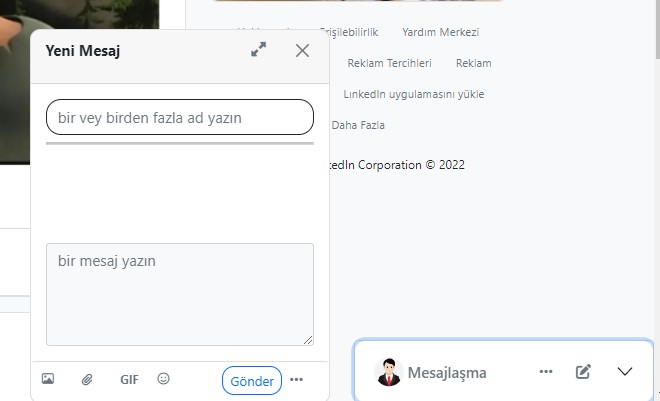 | ) |
| ----------------------- | ------------------------ |


Yukarıdaki resimlerde btn-close tıklandıktan sonraki halini ekliyoruz sayfadan kaybolur.

Card-header alanını oluşturduktan sonra hemen altında  yeni bir div tanımlıyoruz bu div altında da  card-body alanını oluşturuyoruz. Bu alan içinde ayrı ayrı iki tane form-group ekliyoruz. Bu form-grouplar  içinde de input ve textarea oluşturuyoruz. İnputu kullanıcı kime veya kimlere mesaj atmak istiyorsa onların isimlerini girmesi için oluşturduk. İnput'un *type='search'* olarak ayarlıyoruz. Diğer form-group altında da bir textarea oluşturarak kullanıcı için bir mesaj alanı oluşturuyoruz.

```html

          <div id="collapseThree" class="collapse" aria-labelledby="headingThree" data-parent="#accordionExample"></div>
         <div class="card-body">
          <div class="form-group">
            <input type="search" class="form-control border-dark" style="border-radius: 15px;"  aria-label="search" id="ad" placeholder="bir vey birden fazla ad yazın">
          </div>
          <hr class="w3-hover-border-green full-width">
          <br>
          <br>
          <br>
          <br>
          <div class="form-group full-width">
            <textarea class="form-control bg-light" name="" id="mesaj"  placeholder="bir mesaj yazın"  rows="4"></textarea>
          </div>
         </div>
    
```

Mesaj alanını da oluşturduktan sonra card-body içinden çıkarak div altında ul tagı oluşturduk. Bu ul tagı içinde kullanıcı için resim,belge, gıf, emoji, gönder butonu ve 2 tane gönderme seçeneği ekliyoruz. Bunları ul tagı altında li tagları içinde ikonlar şekin de ekliyoruz. 

```html

         <ul class="list-group list-unstyled list-group-horizontal mb-2 ">
          <li class="ms-1 mt-1"><i class="fa-regular fa-image w3-small w3-button btn-sm rounded-circle text-muted" aria-hidden="true"></i></li>
          <li class="ms-1 mt-1"><i class="fa-solid fa-paperclip w3-small w3-button bt-sm rounded-circle text-muted" aria-hidden="true"></i></li>
          <li class="ms-1 mt-1"><span style="font-weight: 700; font-size:12px; " class="w3-button text-muted rounded-circle btn-sm ">GIF</span></li>
          <li class="ms-1 mt-1"><i class="fa-regular fa-face-smile w3-small w3-button btn-sm text-muted rounded-circle"></i></li>
          <li class="ms-5 fw-bold mt-1"><span class="btn btn-sm btn-outline-primary" style="border-radius: 12px;">Gönder</span></li>
          <li class="float-end mt-1">
            <div class="dropdown"></div>
            
            <i class="fa-solid fa-ellipsis w3-medium  text-muted w3-button btn-sm rounded-circle" aria-hidden="true" 
             role="button "tabindex="0" id="dropmesaj" data-toggle="dropdown" aria-expanded="false"></i>
    
```

 

Li elemanı içinde gönder butonunu da oluşturduktan sonra kullanıcı için iki tane gönderme seçeneği tanımlıyoruz. Kullanıcı *fa-ellipsis* ikonuna gelip tıkladığında ona bir tane seçenek penceresi açılacak.  Bu alanı oluştururken ellipsis ikonunu dropdown özelliği altında oluşturduk. Kullanıcı bu ikona tıkladığıda bir tane dropdown menüsü açılacak. Bu menü içinde de 2 tane ayrı ayrı form-check tanımlıyoruz. Bu form-checkler altında da input  *input-form-check tanımladık* inputtan hemen sonradan label alanlarını tanımladık seçeneklerin yanında gösterilecek olan yazıları.

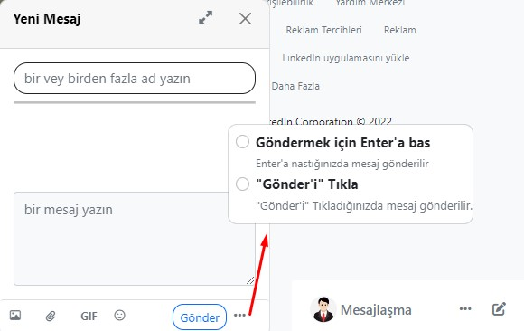

```html
 <li class="float-end mt-1">
            <div class="dropdown"></div>
            
            <i class="fa-solid fa-ellipsis w3-medium  text-muted w3-button btn-sm rounded-circle" aria-hidden="true" 
             role="button "tabindex="0" id="dropmesaj" data-toggle="dropdown" aria-expanded="false"></i>
    
             <div class="dropdown-menu " style="border-radius: 10px;">
              <div class="form-check ms-2">
                <input class="form-check-input w3-medium" type="radio" name="flexRadioDefault" id="flexRadioDefault1">
                <label class="form-check-label" for="flexRadioDefault1">
                  <span class="fw-bold">Göndermek için Enter'a bas</span><br>
                  <span class="text-muted" style="font-size: 12px;">Enter'a nastığınızda mesaj gönderilir</span>
                </label>
              </div>
              <div class="form-check ms-2">
                <input class="form-check-input w3-medium" type="radio" name="flexRadioDefault" id="flexRadioDefault2" >
                <label class="form-check-label" for="flexRadioDefault2">
                  <span class="fw-bold">"Gönder'i" Tıkla</span> <br>
                     <span class="text-muted " style="font-size:13px;  margin-bottom:10px;">"Gönder'i" Tıkladığınızda mesaj gönderilir.</span>
                 
                </label>
```
