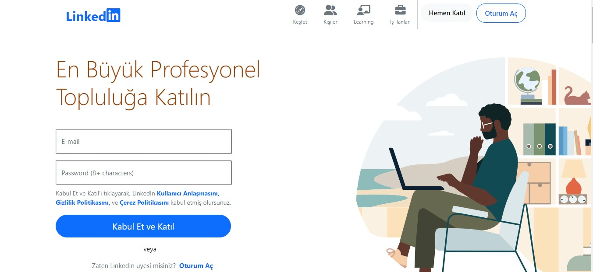
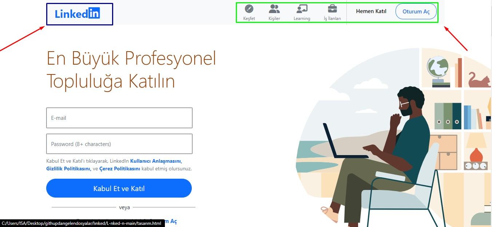
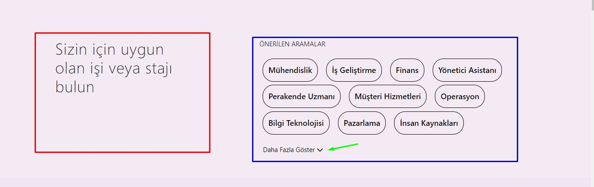
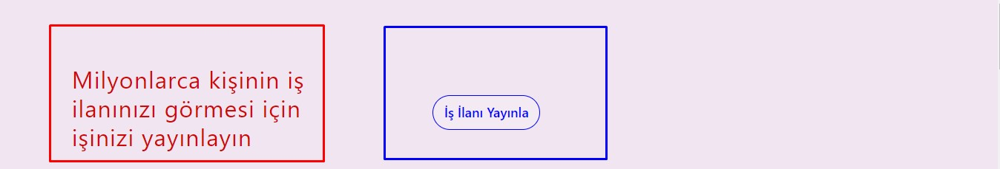
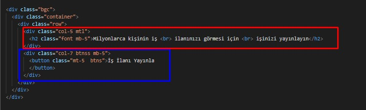
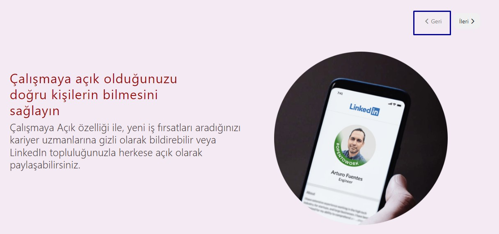
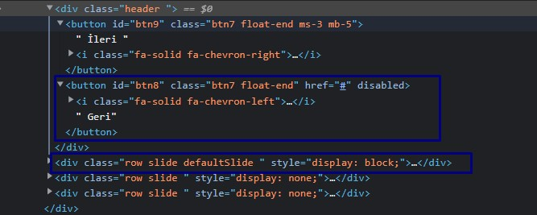
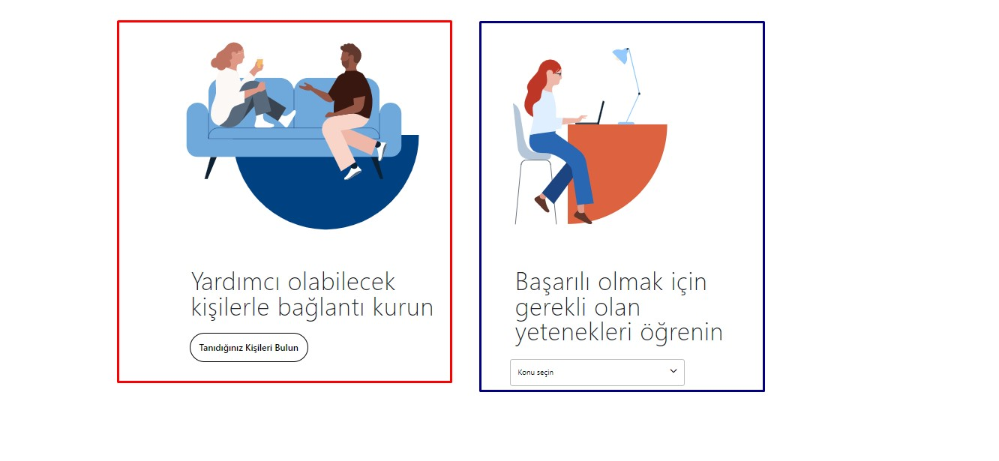

# LINKEDIN KAYIT OLMA VE OTURUM AÇMA SAYFASI

Daha öncedenLinkedIn login alanı  ve anasayfa alanlarını yapmıştık. Bu kez de Linkedin'da oturumu kapat dediğimizde karşımıza çıkan oturum açma ve kayıt olma sayfasını yaptık.



Yukarıdaki resimde ilk olarak bg-white adlı bir class tanımlıyoruz. Bu classı altında container classımızı oluşturuyoruz. Container classı altında da nav etiketi oluşturup,  navbar classını kullanarak menü alanımızı tasarlıyoruz. Nav etiketine style=heigth:65px vererek navbarımızın yülsekliğini ayarlıyoruz. Nav etiketi altında bir tane container-fluid classı oluşturuyoruz. Aşağıdaki resimde de oluşturduğumuz  contaniner-fluid alanımız belli olsun diye bg-light classını kullanıyoruz. Container-fluid classı altında da menü alanımızı oluşturuyoruz. Container-fluid içinde a href etiketi açarak Linkedin yazısını sembolünü menünün sol tarafına yerleştiriyoruz. Lınekdin 'in ksımını oluşturmak  içinde fa-linledin ikonunu kullanıyoruz. 



Linkedin yazısını oluşuturduktan sonra navbar-collapse classı tanımlıyoruz. Bu class altında ul etiketi oluşturuyoruz. Ul tagı içinde de 6 tane li elemanları oluşturuyoruz. Bu li elamanları içinde menü alanımızı ve buttonlarımızı oluşturuyoruz. Menü içinede oluşturmuş oluduğumuz keşfet,kişiler,learning ve iş ilenları için hepsine ayrı ayrı ikon ekliyoruz. Menü alanımızın en sağ tarafında 2 tane buton tanımlıyoruz. Hemen Katıl butonuna tıkladığımızda siteye üye olacağız. Oturum Aç butonuna tıkladığımızda oturum açma sayfasına yönlendirileceğiz.

Menü alanını oluşturduktan sonra oluşturduğumuz container'ı kapatıyoruz başka bir container açıyoruz. Bu container içinede row classı tanımladık.  Row classı içinede 2 tane col-6'lık kolon tanımlıyoruz. 


İlk col-6 kolon içinde yukarıdaki resimde gördüğünüz kırmızı kare içindeki alanda  email inputunu, password inputunu  ve kabul et ve katıl   butonumuzu oluşturuyoruz. Col-6 kolan içinde h1 etiketi oluşturarak (En Büyük Profesyonel Topluluğa Katılın) başlığımızı oluşturuyoruz. h1 etiketinin hemen altında form-floating classları oluşturduk. Bu classlar içine  de email inputunu ve password inputlarını ekliyoruz.

```html
 <div class="col-6">
          <h1 class="display-4 th1 fw-light">En Büyük Profesyonel <br> Topluluğa Katılın</h1>
          <form class="mt-5">
            <div class="form-floating inpy text-muted ">
              <input type="email" class="form-control" id="floatingInput" placeholder="E-mail" required>
              <label for="floatingInput">E-mail</label>
            </div>
            <div class="form-floating mt-3 inpy text-muted">
              <input type="password" class="form-control" id="floatingInput" placeholder="Password (8+ characters)"
                required>
              <label for="floatingInput">Password (8+ characters)</label>
            </div>
  ...
         </form>
</div>


```

Inputları da oluşturduktan sonra form etiketinin altında bir tane p etiketi oluşturuyoruz bu etiket içinde a href etiketi oluşturarak Kullanıcı Antlaşması, Gizlilik politikası ve çerez politikası sayfalarını bağlantı yolu oluşturuyoruz. Kullanıcı  kabul et ve katıl butonuna tıklarsa yukarıda belirtilen antlaşmaları kabul etmiş olacak.

p tagi  altında da button elemanı tanımlıyoruz kullanıcı form içindeki inputları doldurduktan sonra bu butana tıkladığındaLinkedIna katılmış olacak. Buttona btn btn-primary özelliğini kullanarak mavi bir renk veriyorız. Butonun genişiğine max-width classını kullanarak 400px veriyoruz.

```css
.buttonka{
   max-width: 400px;
    padding: 10px 18px;
    border-radius: 30px;
    font-size: 20px;
    
}

```

Butonu da oluşturduktan sonra div tagı oluşturuyoruz bu tag içinde zaten LinkedIn'a üyemisiniz diye bir metin oluşturuyoruz. Div  tagı içinde span tagı, span tag ı içinde a href tagı oluşturuyoruz bu a href tagı içinde oturum aç diye bir bağlantı yolu oluşturuyoruz. Kullanıcı oturum aç yazısına tıklarsa oturum açma sayfasına yönlendirilecek.

```javascript
 <div class="text-center align-items-center  text-muted text-normal me-5"
            style="margin-left: -50px;"> Zaten LınkedIn üyesi misiniz?
            <span><a href="#"  class=" ms-1 fw-bold hv"> Oturum Aç</a></span>
          </div>

```

Diğer col-6'lık kolon içinde ise Linkedın'nın orjinal hesabından aldığımız resmi alıp img etiketi'nin src özelliği ile sayfamıza ekliyoruz. Resmin genişliğine width:700px soldan uzaklığına ise margin-left :120px  veriyoruz ve  resmi sayfamızda konumlandırıyoruz.

```css
.timg{
	width: 700px;
 	margin-left: 120px;
}
```


Container içinde input ve buton alanlarını oluşturduktan sonra yeni bir bgc classı adında yeni bir div tagı oluşturuyoruz bu tag içinde de resimde gösterilen kırmızı ve mavi renkteki dikdörtgenler içindeki alanları oluşturuyoruz. bgc adlı classın backround-color=#f0e5f0 rengi veriyoruz ve bu renk div'in tamamını kaplayacak. Bgc classı altında container, container altında da row ve row içinde de col-5 ve col-7 olmak üzere iki tane colon oluşturuyoruz. Yukarıdaki resimde kırmızı dikdörtgen içindeki alanı col-5'lik kolon içinde oluşturuyoruz bu colona .**mtr{margin-top:100px;margin-bottom:50px;** mtr  classı ekleyerek kolonumuzu  konumlandırıyoruz. Bu kolon içinde h2 tagı oluşturuyoruz. Oluşturduğumuz bu tag içinde de  **LınkedIn'da ne yapabileceğinizi görün** şeklinde bir başlık ekliyoruz. Mavi dikdörtgen içindeki alanı da col-7 kolonu içinde oluşturuyoruz. Bu kolon içinde ul tagı, bu tag  içinde de 3 tane li etiketi oluşturuyoruz. Her li etiketine içine box classı ekliyoruz. Her li etiketinin genişiliğinı  65% olarak ayarlıyoruz, padding 18px vererek sanki metin içindeymiş gibi bir görüntü veriyoruz. Her li etiketi içinede fa-chevron-right ikonu ekliyoruz.

```
.box{
 width: 65%;
  border: none;
  outline: none;
  background-color: white;
  border-radius: 12px;
  padding: 18px
}
```

```html
 <div class="bgc">
    <div class="container">
      <div class="row">
        <div class="col-5 mtr">
          <h2 class=" font ">LınkedIn'da ne <br> yapabileceğinizi görün</h2>
        </div>
        <div class="col-7  mt-5">
          <ul class=" list-unstyled wit me-5">
            <li class="box mt-3">İl İlanı Arayın <i class="fa-solid fa-chevron-right float-end"></i></li>
            <li class=" box mt-3">Tanıdığınız Bir Kişiyi bulun <i class="fa-solid fa-chevron-right float-end"></i></li>
            <li class="box mt-3">Yeni bir yetenek öğrenme <i class="fa-solid fa-chevron-right float-end"></i></li>

          </ul>
        </div>
      </div>
    </div>
  </div>
```

bgc classına sahip div tagı altında yeni bir div tagı oluşturuyoruz. Bu yeni div tagı içine de lınkd classını ekliyoruz. Bu lınkd classına **background-color: #f3eaf3;** özelliğini atıyoruz. Bu özelik ile lınkd classına sahip olan div'in arka plan rengini #f3eaf3 rengine boyuyoruz. Bu div içinde container, container içinde row, row içinde de col-5 ve col-7 kolonlarını oluşturuyoruz. 



Kırmızı dikdörtgen içinde gösterilen alan col-5'lık kolonumuzun olduğu alan. Col-5 kolonu içinde h2 tag'ı oluşturuyoruz bu etiket içine **Sizin için uygun olan işi ve satjı bulun** diye bir başlık atıyoruz. Mavi dikdörtgen alan içindeki alan ise col-7 kolonumuzun olduğu alan. Bu kolon içinde p, ul  ve button taglarını oluşturuyoruz. P tag'ı içine Önerilen Aramalar diye bir metin ekliyoruz. Ul tagı içinde list-inline classını kullanarak li elemanları tanımlıyoruz . Tanımladığımız  bu her li elemanı içine de buton elamanı ekliyoruz. Bu butonlar içine de btnlu ve btnli classlarını ekliyoruz. 

```css
.btnlu{
  
  padding: 12px;
  border: 1px solid;
  background-color: #f3eaf3;
  border-radius: 25px;
  cursor: pointer;

}

.btnlu:hover{
  cursor: pointer;
  background-color:#f0ddf0;
}

.btnf{
  font-size: 18px;
  font-weight:500;
}
```

Yukarıda yeşil okla gösterilen alanda daha az göster ve  daha fazla göster  diye iki tane span tagı ekliyoruz.  Span taglar'ının id bilgilerini kullanarak javascript ile click olayı ekliyoruz.

```
   <span id="low"></span><span id="more">
```


|  |  |
| ---------------------- | ---------------------- |

Ul tagını oluşturduktan sonra ul tagının hemen altına button elemanı ekliyoruz. Bu butona onclick özeliği ekliyoruz. Bu onclickleLinkedInFunction adlı bir fonksiyon tanımlıyoruz. Butona tıkladığımızda onclick ile tanımlamış olduğumuz fonksiyon çalışacak.

```javascript
 <button onclick="lınkedınFunction()" class="mb-5" id="lınkedIn">Daha Fazla Göster <i class="fa-solid fa-chevron-down" style="margin-left: 10px;"></i> </button>
     
functionLinkedInFunction(){
    const low = document.getElementById("low");
    const more = document.getElementById("more");
    constLinkedIn =document.getElementById("lınkedIn");


    if(low.style.display === "none"){
        low.style.display="inline";
        
       LinkedIn.innerHTML = "Daha Fazla Göster  <i class='fa-solid fa-chevron-down'  style= 'margin-left=10px'></i>";
        more.style.display="none"
    }else{
        low.style.display="none";
       LinkedIn.innerHTML="Daha Az Göster <i class='fa-solid fa-chevron-up' style= 'margin-right=10px'></i>"
        more.style.display="inline"
    }
}
```

lınkedınFunction fonksiyonu içinde, span tagı içindeki id bilgilerini alıp değişken içerisine atıyoruz. Button içindeki id bilgsini alıpLinkedIn değişkeni içerisine atıyoruz. Bu değişkenler üzerinden javascript kodalarımızı yazacağız. Eğer low id'sine sahip span tagı'nın style'si display: none ise style'yı display inline yap diyoruz.  Yani daha az göster butonu aktif iseLinkedIn id'sine sahip butonun içine daha fazla göster ve fa-chevron-down ikonunu ekle diyoruz. more id'sine span tagı içinede display none özelliğini ekliyoruz.


Yukarıda soldaki resimde yeşil okla gösterilen alan aktif olduğunda more id'sine sahip span içindeki li egösterilmeyecek. Daha fazla göster butonuna tıkladığımızda low id'sine sahip span etiketi display none olacak. more id'sine sahip span etiketi inline olacak. Bu kez butonun içerisine daha az göster ve fa-chevron-up ikonu eklenecek.  Sağdaki resimde yeşil okla gösterildiği gibi olacak.

lınkd classına sahip div elemanını da oluşturduktan sonra  bu divin  altında bgc classına sahip yeni bir div tagı oluşturuyoruz. Bu div içinde container, container içinde row, row içinde de col-5 ve col-7 classlarına sahip 2 kolan oluşturuyoruz.



Yukarıdaki resimde kırmızı dikdörgen içindeki alanı col-5 kolonu içinde oluşturuyoruz. Col-5 kolonu içinde de h2 tagı oluşturuyoruz. H2 tagı içine *Milyonlarca kişinin iş ilanınızı görmesi için işinizi yayınlayın* şeklinde bir başlık ekliyoruz. Bu etiket içinde font classımızı oluşturarak h2 tagı içinde yer alacak olan başlığın boyutunu,satırlar arası boşluğu, metin  rengini  ve tonunu ayarlıyoruz.

```css
.font{
  font-weight: 400;
  color: 	#cf0707;
  font-size: 36px;
  letter-spacing: 1px;
  

}

.btns{
  font-weight: 500;
  padding: 10px 16px;
  border-radius: 30px;
  font-size: 20px;
  color: blue;
  border: 1px solid;
  background-color:  #f3eaf3;
}
```

Mavi dikdörtgen içindeki alanı ise col-7'lik kolon içinde oluşturuyoruz. Bu kolon içinde *iş ilanı yayınla* diye bir button elemanı oluşturuyoruz.  Buton içine btns classını ekliyoruz. Bu class içindeki özellikler ile butonun boyutunu rengini, arka plan rengini, buton içindeki metinin boyutunu ayarlıyoruz.



bgc classına sahip olan div tagını oluşturduktan sonra div'in yeni bir lınkd callsına sahip yeni bir div tagı oluşturuyoruz.


lınkd classı içinde container classını oluşturyoruz. Container içinde row, row içinde de header ve 3 tane row classı oluşturuyoruz.

Header classı içinde yukarıdaki resimde kırmızı dikdörtgen içinde oklarla gösterilen ileri ve geri butonlarını oluşturuyoruz. Bu butonları row altında header classı içinde oluşturuyoruz. İleri ve geri butonların classlarına btn7 class özelliğini ekliyoruz. Bu class içindeki özellikler buttonun rengini boyutunu, buton içindeki boyutunu ayarlıyoruz. Her iki butona da ikonlar ekliyoruz. Bu butonlar sayesinde diğer slaytlar arasında geçiş yapabileceğiz.

```html
 <div class="header ">
          <button id="btn9" class="btn7 float-end ms-3 mb-5"> İleri <i class="fa-solid fa-chevron-right"></i></button>
          <button id="btn8" class="btn7 float-end" href="#"><i class="fa-solid fa-chevron-left"></i>
            Geri</button>
        </div>
```

Header classının altında row, slide classlarını tanımlıyoruz. Bu row içinde col-12'lik kolon için de iki tane col-6 kolonu tanımlıyoruz. Col-12 classı içinde d-inline-flex classı kullanarak col-6 kolonlarını yan yana getiriyoruz.


Kırmızı dikdörtgen içinde gösterilen col-6 kolonu içinde h2 ve p taglarını kullanarak oluşturuyoruz. H2 etiketi içine *Çalışmaya açık olduğunuzu doğru kişilerin bilmesini sağlayın* şeklinde bir başlık ekliyoruz. H2 tagı içined font9 classını kullanıyoruz. Bu class ile başlığımızın rengini boyutun, yazı tonunu, satır arası boşlukları ayarlıyoruz. P tagı içinde metin ekliyoruz. P etiketi içinde font9a classını kullanıyoruz.

```css
.font9{
  font-weight: 400;
  color: 	#9c0a0a;
  font-size: 36px;
  letter-spacing: 1px;
  margin-top: 50px;

}

.font9a{
  font-weight: 350;
  color: 	#514646;
  font-size: 28px;
line-height: 34px;
}
```

Bu yapıdan farklı farklı iki tane daha row classı içinde col-12 kolonları altında col-6 kolonları oluşturarak yeni slaytlar oluşturuyoruz. Bu slaytlar içinde de aynı class özelliklerini kulllanıyoruz. Yukarıdaki resimde siyah kutu içindeki ileri butonuna basarsak bize sonraki slaytı getirecektir.  

```html
 <div class="row slide defaultSlide ">
          <div class="col-12 d-inline-flex">

            <div class="col-6 mt-3 d-inline-block area">
              <h2 class="font9">Çalışmaya açık olduğunuzu <br> doğru kişilerin bilmesini<br> sağlayın</h2>
              <p class="font9a">Çalışmaya Açık özelliği ile, yeni iş fırsatları aradığınızı kariyer uzmanlarına gizli
                olarak bildirebilir veya LinkedIn topluluğunuzla herkese açık olarak paylaşabilirsiniz.</p>
            </div>
            <div class="col-6  ms-5 mt-3 row1">
              
            </div>
          </div>


        </div>
```


| 1-SLAYT | 2-SLAYT | 3-SLAYT |
| :-----------------------------: | :-----------------------------: | :-----------------------------: |

Sayfa yüklendiğinde 1-slayt'ın gösterilmesi için defaultSlide classını ekliyoruz. DefaultSlide classı ile sayfa yüklendiğinde bize gösterilecek olan slayt.  Bu class içine display:block özelliğini ekliyoruz. Diğer slaytlarını gözükmemesi için de hepsine slide classını ekliyoruz. Slide classının özelliğine de display: none özelliği ekliyoruz. İleri ve geri butonlarına tıkladığımızda açılan slayta display:block özelliği eklenecek diğer slaytlar ise display:none olacak. Slaytlar üzerinde geçiş olayını gerçekleştirmek için buttonlara javascript kodları ile işlevsellik ekliyoruz.

btn9 id'sine sahip olan ileri butnonunu next adlı değişken içerisine atıyoruz. btn8 id'sine sahip olan geri butonunu da prev değişkeni içerisine atıyoruz. Bütün slaytlar içinde tanımladığım slide classını alıp displaySlide değişkeni içerisine atıyoruz. Slaytlar arasında geçiş sağlamak için index değerine 1 veriyoruz. next adlı değişken içindeki butona click olayı ekleyip fonksiyon oluştruyoruz. Next butonuna tıkladığımızda bu fonksiyon çalışacak.  Fonksiyon içinde if else karar yapısı oluşturuyoruz. İf içinde eğer index displaySlide.length az ise index ++ index 1 artarak artmaya devam etsin. index=displaySlide.length ise yani index numarası displaySlide numarasıyla eşit ise artma işlemi gerçekleşmesin ve next butonuna disabled özelliğini verelim. Prev butonuna tıkladığımızda next üzerinde ki disabled özeliğini kaldıracağız. Kırmızı dikdörgen içine next butonunun disabed'a background-color: \#f3eaf3; özelliğini verdik zaten mouse ile buton üzerine gittiğinizde cursor:pointer özelliği, cursor:not-allowed olacak. 


Fonksiyon içinde for döngüsü oluşturarak index index'den kuçuk olanlara display="none" özelliğini ekliyoruz. DisplaySlide[index-1].ise displayına block ekle diyoruz.

Prev butonuna tıkladığımızda ise index!=0 index numarası 0 eşit değilse index 1 azalarak devam etsin. index=0 index 0'a eşit ise azalma işlemi dursun ve prev butonuna disabled özellliğini eklesin aşağıdaki resimde mavi dikdörtgen alanı içindeki alanda prev butonunun disabled özeliğine css ile background-color: \#f3eaf3; özelliğini veriyoruz.İf Else karar değişkeninden sonra for döngüsü oluşturarak display none özeliğini ekliyoruz. displaySlide[index]. açık olan index'e ise block özelliğini  ekliyoruz.





lınkd classına sahip div elemanından sonra content classına sahip div tagı oluşturuyoruz. Bu div elemanı içinde container, container içinde  row, row içinde de 2 tane col-6 kolonu oluşturuyoruz.



Kırmızı kare içindeki col-6 kolonu içinde img etiketi tanımlayıp resim ekliyoruz bu resmiLinkedInın kendi hesabındaki resmi svg olarak alıyoruz. Resmin boyutunu ve yüksekliğini w-75(w:width) ve h-75 (h:height) özelliklerini kullanarak ayarlıyoruz. Img'nin altında h1 etiketi içinde *Yardımcı olabilecek kişilerle bağlantı kurun* şeklinde bir başlık oluşturuyoruz. Başlığın altında *Tanıdığınız Kişileri Bulun* diye bir buton ekliyoruz. Butona btnf ve btnlu classları ekliyoruz. Bu classlar içinde butonun boyutunu, rengini, konumunu ve buton içindeki metinin boyutunu ve renk tonunu ayarlıyoruz.

```css
.btnlu{
  
  padding: 12px;
  border: 1px solid;
  background-color: #f3eaf3;
  border-radius: 25px;
  cursor: pointer;

}

.btnlu:hover{
  cursor: pointer;
  background-color:#f0ddf0;
}

.btnf{
  font-size: 18px;
  font-weight:500;
}
.tash2{
  margin-top: 25px;
  font-weight: 320;
  font-size: 50px;
  margin-left: 10px;
  line-height: 50px;
  letter-spacing: 1px;
}
```

Mavi kare içindeki col-6 kolon içinde de img tagı ekliyoruz. Bu etiketin src özeliğineLinkedIn üzerinden aldığım svg resmini ekliyoruz resmin boyutunu w-75(w:width), h-75  (h:height)olarak ayarlıyoruz. h1 etiketi içinde tash2 classını kullanarak *Başarılı olmak için gerekli yetenekleri görün* diye bir başlık tanımlıyoruz. h1 etiketini oluşturduktan sonra div içinde dropdown class oluşturuyoruz. Bu dropdown içinde buton tanımlıyoruz. Butonun boyutunu ve yüksekliğini .drmen{width: 350px height: 400px; overflow: scroll;} drmen class içinde oluşturuyoruz. Buton içinde span tagı oluşturuyoruz bu span tagıiçine *konu seçin* şeklinde yazı ekliyoruz. Span etiketi yanına fa-chevron-down ikonu ekliyoruz. Bu botuna tıkladığımızda bize açılır bir liste açılacak.


Buton elemanından sonra dropdown-menu classını oluşturuyoruz. Bu class içinde ul tagı oluşturuyoruz, ul tagı içinde de li taglarını oluşturuyoruz. Bu li tagları içinde a href özelliğini kullanarak bağlantı yoları oluşturuyoruz. Li tagları içinde kurs adı ve toplam kurs sayısıt-yazıyor.  Kurs adını h1 tagı içine yerleştiriyoruz. Kurs sayısını da p tagı içine yerleştiriyoruz.

Content classına sahip div'den sonra bgı clasına sahip yeni bir div oluşturuyoruz. Bgı classına background-image özeliği ekleyerek div'in arka planınaLinkedInın kendi sayfasından aldığımız resmi yerleştiriyoruz. Bgı classı altında container oluşturuyoruz bu container içinde row, row içinde de col-10 ve col-2 kolonlarını oluşturuyoruz. Col-10 kolonu içinde h1 tagı oluşturuyoruz. Bu tag içinde *LınkedIn'deki iş arkadaşlarınıza, okul arkadaşlarınıza ve dostlarınız katılın.* şeklinde bir başlık atıyoruz. H1 tagı altında buton elemanı ekliyoruz. Buton içine btnbas ve btnbas1 classlarının vererek butonun rengini  konumunu ve boyutunu, buton içindeki metinin rengini ve netinin boyutunu da ayarlıyoruz.

```css
.bgı{
  background-image: url(ımg/dadad.JPG);
  height:500px;
  object-fit: contain;

}
  .btnbas{
    
    border-radius: 30px;
    padding: 14px 20px;
    border: 1px solid transparent;
    background-color:  #075dba;

  }

  .btnbas:hover{
    background-color: #08498e;
  }

  .btnbas1{
    font-size: 18px;
    font-weight:500;
    color: white;
  }

```


Bgı classına sahip olan div2in altında footer classına sahip div elemanı oluşturuyoruz. Footer classı içinde container, container içinde row, row içinde de 5 tane col-2 kolonu oluşturuyoruz.


Yukarıdaki resimde kırmızı dikdörtgen içindeki alanı col-2 kolonu içinde oluşturuyoruz. H4 tagıiçinde Linked yazsını ekliyoruz. Lınked yazısının yanına da fa-linledin(in) ikonunu ekliyoruz.

Diğer Col-2 alanları içinde h6 taglarını ekliyoruz. Her col-2 colonunun h6 tagına balıklar ekliyoruz. H6 tahlarının altına'da ul tagları ekliyoruz. Her ul tagıiçine li tagı ekliyoruz. Li tagları içinde de a href tagları kullanarak bağlantı yolu oluşturuyoruz.

Footer classına sahip div tagı altına da end classına sahip bir div tagı ekliyoruz. Bu div içinde container, container içinde row ve row içinde de col-12 lik kolon tanımlıyoruz. Col-12 kolonu içinde footer tagı oluşturuyoruz. Bu footer tagı içinde ul tagını oluşturuyoruz. Ul tagının classına list-group, list-group-inline, list-group-horizontal, lsit-unstyled özelliklerini veriyoruz. Ul altında da  li elemanları oluşturuyoruz bu li tagları ul içine eklediğim class özellikleri sayesinde yan yana duracaklar. Oluştururlan her li tagına a href etiketi ekleyerek bağlantı yolu oluşturuyoruz. Ul içindeki herhangi bir li tagına tıkladığımızda da bizi  ilgili sayfaya yönlendirecek.


Kırmızı dikdörtgen içindeki dil yazısına tıkladığımda bana açılır bir liste açılacak bu liste içinde istediğimiz dili seçebileceğiz. 


Dil'in olduğu li tagı içindeki a href etiketine dropdown-toggle classı ekliyoruz. A href tagının type=button özelliği ekliyoruz. A href tagıaltında dropdown-menu classına sahip bir div tagıekliyoruz. Bu div içinde ul tagı oluşturarak li tagları tanımlıyoruz. Her li tagı içine  a href tagını, a href tagı içine de p taglarını ekliyoruz. P tagları içinde ülke dillerini yazıyoruz. Ayrıca seçili olan dile active cllası ekliyoruz. Active classına sahip olan li tagının arka plan rengi mavi olacaktır.

